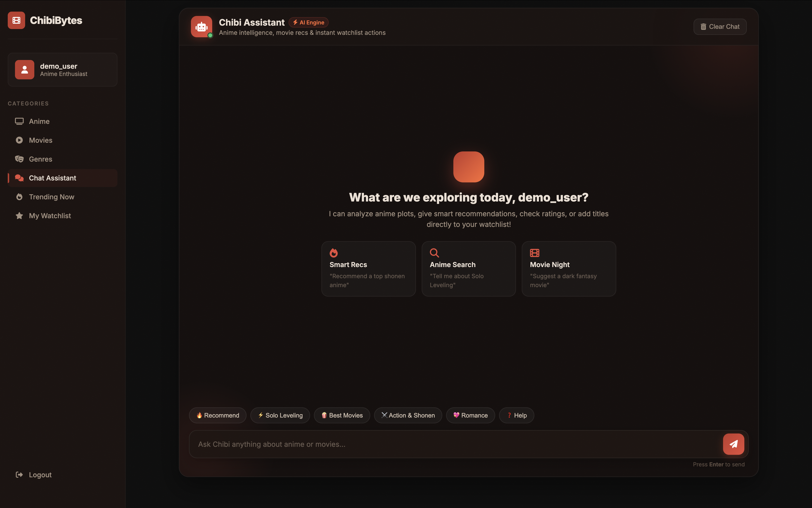
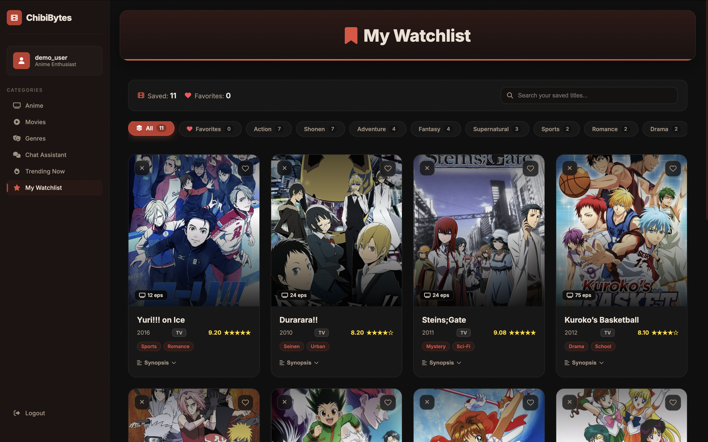

# 🎌 ChibiBytes — AI-Powered Anime & Movie Discovery

A full-stack anime & movie discovery web application built with **Flask**, **Google Gemini AI**, and **PostgreSQL (Neon)**. It combines real-time catalog search, synchronous watchlist management, and an intelligent AI assistant.

[](https://chibibytes-vutq.onrender.com/)
[](https://www.python.org/)
[](https://flask.palletsprojects.com/)
[](https://neon.tech/)
[](https://ai.google.dev/)

---

## 🌐 Live Demo & Screenshots

🔗 **Live Application**: [https://chibibytes-vutq.onrender.com/](https://chibibytes-vutq.onrender.com/)

| 💬 AI Discovery Chatbot | 📋 Synchronous Watchlist |
| :---: | :---: |
|  |  |

---

## ✨ Features

- 🤖 **Smart AI Assistant**: Powered by Gemini 1.5 Flash to recommend titles, provide insights, and parse user search queries with fallback offline support.
- ⚡ **Instant Search & Filters**: Browse anime and movies across 12 genres, trending lists, and top-rated cards.
- 📌 **Zero-Flicker Watchlist**: Save favorites instantly with synchronous in-memory state tracking.
- ☁️ **Dual Database Architecture**: Cloud PostgreSQL (Neon) with seamless local SQLite fallback for offline development.
- 🛡️ **Secure Authentication**: User sign up and login with PBKDF2:SHA256 password hashing and session management.
- 🎛️ **Admin Dashboard**: Real-time catalog search and management modal for updating titles and media links.

---

## 🛠️ Tech Stack

- **Backend**: Python 3.11+, Flask, Gunicorn
- **Database**: Neon PostgreSQL (Production), SQLite3 (Local / Testing)
- **AI / LLM**: Google GenAI SDK (Gemini 1.5 Flash)
- **Frontend**: Vanilla HTML5, Modern CSS3 (Glassmorphism & Responsive Grids), JavaScript (ES6+)

---

## 🚀 Quick Start (Local Setup)

### 1. Clone the repository
```bash
git clone https://github.com/Spidey173/ChibiBytes.git
cd ChibiBytes-main
```

### 2. Set up virtual environment & install dependencies
```bash
python3 -m venv venv
source venv/bin/activate    # On Windows use: venv\Scripts\activate
pip install -r requirements.txt
```

### 3. Configure Environment Variables (Optional)
Create a `.env` file in the root directory (or export directly):
```env
GEMINI_API_KEY=your_gemini_api_key_here
DATABASE_URL=your_neon_postgres_url_here  # Optional: defaults to local SQLite
```
*(Note: If no keys are provided, the app will automatically run in local SQLite fallback mode).*

### 4. Run the application
```bash
python app.py
```
Open **`http://localhost:5002`** in your browser.

---

## 🧪 Running Tests

Run the automated unit test suite:
```bash
python -m unittest test_app.py
```

---

## 📁 Project Structure

```text
ChibiBytes/
├── app.py                  # Application entry point & Flask configuration
├── routes.py               # Page routes, API endpoints & session authentication
├── database.py             # Database pooling & schema lifecycle (PostgreSQL / SQLite)
├── chatbot.py              # Google Gemini AI agent & prompt generation logic
├── test_app.py             # Automated unit testing suite
├── requirements.txt        # Python package dependencies
├── run.sh                  # Shell script for automated local setup & execution
├── render.yaml             # Render cloud deployment configuration
├── LICENSE                 # MIT License
├── Images/                 # Documentation assets & screenshots
│   ├── Chat.png            # AI Chatbot interface screenshot
│   └── Watchlist.png       # Watchlist interface screenshot
└── templates/              # Jinja2 frontend HTML templates
    ├── index.html          # Landing & home page
    ├── login.html          # User login page
    ├── signup.html         # User registration page
    ├── main-app.html       # Base layout & navigation shell
    ├── chat.html           # AI Chatbot interactive discovery interface
    ├── anime.html          # Anime catalog browser with sync watchlist
    ├── movies.html         # Movies catalog browser with sync watchlist
    ├── genres.html         # Multi-genre filter & slider carousel view
    ├── trending.html       # Trending & top-rated titles
    ├── watchlist.html      # User bookmark manager grid
    └── admin.html          # Admin catalog search & management modal
```

---

## 📄 License

This project is licensed under the [MIT License](LICENSE).
